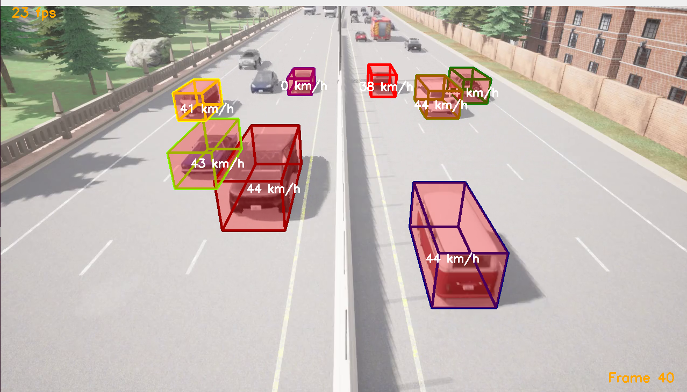
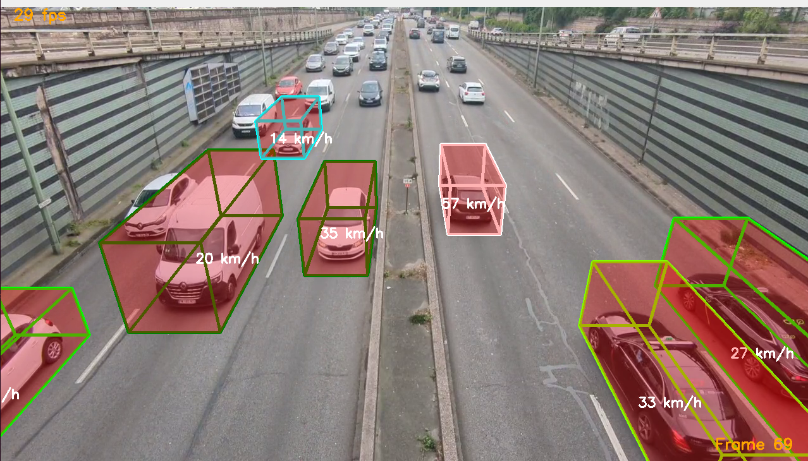
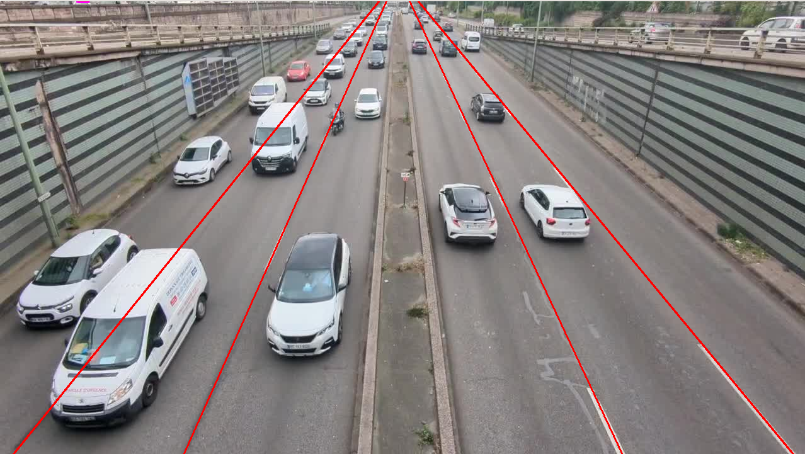
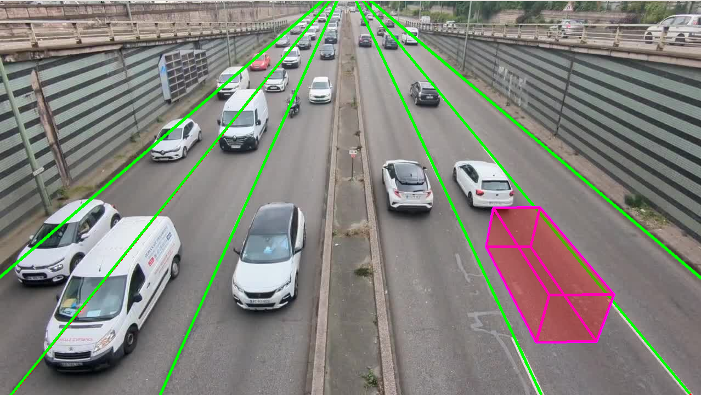

# 3D bounding box tracking on highway

Let's suppose that you want to detect all types of vehicles on a highway from a camera located on a bridge. The goal of this project is to detect them while estimating their dimensions and not to detect any type of vehicles (car, truck, van etc). 

The main problem to do it with a monocular camera, in comparison to RGB camera or LiDAR, is to regress 3D dimensions from 2D image. Moreover, obtaining a groundtruth of a real-life record requires huge means. This is why I decided to use the Carla simulator to build up my dataset where the bounding box dimensions are perfectly known.

Once the training is done, you can track cars individually and generate statistics on it (averaged speed, dimensions distributions...).

My contribution has 4 components:
- a [camera calibration algorithm](#camera-calibration) to find camera pose above the highway
- a python script to interact with Carla simulator and generate a [groundtruth](annotation/README.md)
- a [Centernet-based network](centernet-3d-bbox.ipynb) to regress positions and dimensions
- a tracking algorithm with a Kalman Filter

<p>
<em>Tracking on Carla simulation</em></br>

</p>

<p>
<em>Tracking on Highway</em></br>

</p>

[YouTube video link](https://youtu.be/3leAX-MhMQE)

## Inference

For detection only
```
python multi_object_detection.py path/to/video.mp4 centernet-3d-bbox.pth --conf 0.2
```

For full tracking:
```
python multi_object_tracking.py path/to/video.mp4 centernet-3d-bbox.pth --conf 0.2
```

## Camera calibration

Let's suppose that your instrinc camera matrix was already estimated with a checkerboard.

Now we want to estimate the camera pose (position + orientation) in the world referential by using the driving lanes (parallel lines with known interdistance). Regarding the orientation, we assume that we have no roll, and we only want to estimate the pitch and the yaw of the camera. We also assume that the yaw is quite small.

<p>
<em>Camera pose estimation with lanes</em></br>

</p>

### Pitch and yaw estimate

$\alpha$ = pitch

$\beta$ = yaw

The rotation matrix can be derived by multiplying the 2 Euler matrices:

```math
\begin{pmatrix}
1 & 0 & 0\\
0 & \cos \alpha & \sin \alpha\\
0 & -\sin \alpha & \cos \alpha
\end{pmatrix}
\begin{pmatrix}
\cos \beta & 0 & \sin \beta\\
0 & 1 & 0\\
-\sin \beta & 0 & \cos \beta
\end{pmatrix}
=
\begin{pmatrix}
\cos \beta & 0 & \sin \beta\\
-\sin \alpha \sin \beta & \cos \alpha & \sin \alpha \cos \beta\\
-\cos \alpha \sin \beta & -\sin \alpha & \cos \alpha \cos \beta
\end{pmatrix}
```

Then we can form the transformation matrix (reminder: $\beta$ is small)

```math
T
=
\begin{pmatrix}
1 & 0 & \beta & t_x\\
- \beta \sin \alpha & \cos \alpha & \sin \alpha & t_y\\
-\beta \cos \alpha & -\sin \alpha & \cos \alpha & t_z\\
0 & 0 & 0 & 1
\end{pmatrix}
```

So if you want to transform a 3D point from world coordinates that lies on the ground ($Y_w = 0$) to camera coordinates:

```math
\begin{pmatrix}
X_{cam}\\
Y_{cam}\\
Z_{cam}\\
1
\end{pmatrix}
=
\begin{pmatrix}
1 & 0 & \beta & t_x\\
- \beta \sin \alpha & \cos \alpha & \sin \alpha & t_y\\
-\beta \cos \alpha & -\sin \alpha & \cos \alpha & t_z\\
0 & 0 & 0 & 1
\end{pmatrix}
\begin{pmatrix}
X_w\\
0\\
Z_w\\
1
\end{pmatrix}
=
\begin{pmatrix}
X_w + \beta Z_w + t_x\\
-\beta \sin \alpha X_w + \sin \alpha Z_w + t_y\\
-\beta \cos \alpha X_w + \cos \alpha Z_w + t_z\\
1
\end{pmatrix}
```

If we consider the a point very far away where lanes intersect, we have $Z_w >> X_w$ that is very high:

```math
\begin{pmatrix}
X_{cam}/Z_{cam}\\
Y_{cam}/Z_{cam}
\end{pmatrix}
=
\begin{pmatrix}
X_w + \beta Z_w + t_x \over \cos \alpha Z_w\\
\sin \alpha Z_w + t_y \over \cos \alpha Z_w
\end{pmatrix}
\approx
\begin{pmatrix}
\beta \over \cos \alpha\\
\tan \alpha
\end{pmatrix}
```

Now when we project those points on the image, we get the pixel coordinates of the lane intersection point:

```math
\begin{pmatrix}
x\\
y
\end{pmatrix}
=
\begin{pmatrix}
f & 0 & c_x\\
0 & f & c_y\\
0 & 0 & 1
\end{pmatrix}
\begin{pmatrix}
\beta \over \cos \alpha\\
\tan \alpha\\
1
\end{pmatrix}
=
\begin{pmatrix}
f {\beta \over \cos \alpha} + c_x\\
f \tan \alpha + c_y
\end{pmatrix}
```

This is how we can estimate the pitch and yaw angle:

$$
\tan \alpha = {y - c_y \over f}
$$
$$
\beta = (x - c_x) {\cos \alpha \over f}
$$

### Translation estimation

For this, we consider the points of each lane at the bottom of our image. We fix our origin by declaring that those points have $Z_w = 0$. We still consider that $\beta \approx 0$.

```math
\begin{pmatrix}
f & 0 & c_x\\
0 & f & c_y\\
0 & 0 & 1
\end{pmatrix}
\begin{pmatrix}
X_w + t_x \over t_z\\
t_y \over t_z\\
1
\end{pmatrix}
=
\begin{pmatrix}
u\\
v\\
1
\end{pmatrix}
```

The values of $X_w$ can be found by using google maps, where you can measure exactly the distance between the lanes.

It leads:

$$
f (X_w + t_x) = (u - c_x) t_z
$$
$$
f t_y = (v - c_y) t_z
$$

Then

```math
\begin{pmatrix}
f & 0 & c_x - u\\
0 & f & c_y - v
\end{pmatrix}
\begin{pmatrix}
t_x\\
t_y\\
t_z
\end{pmatrix}
=
\begin{pmatrix}
-f X_w\\
0
\end{pmatrix}
```

And this works for every points. This can be easily solved by using a least square regression, where you write all your equations in a single matrix equation:

```math
A
\begin{pmatrix}
t_x\\
t_y\\
t_z
\end{pmatrix}
=
b
```

Then, optimal values are:

```math
\begin{pmatrix}
t_x\\
t_y\\
t_z
\end{pmatrix}
=
(A^T A)^{-1} A^T b
```

### Results

You can check the results visually:

<p>
<em>Camera pose estimation with lanes reprojected</em></br>

</p>