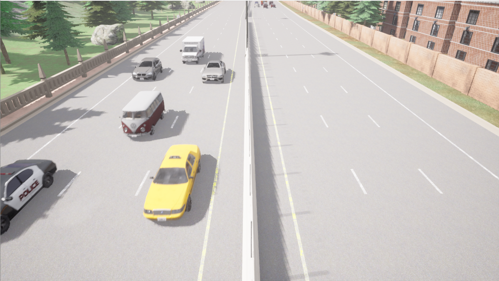
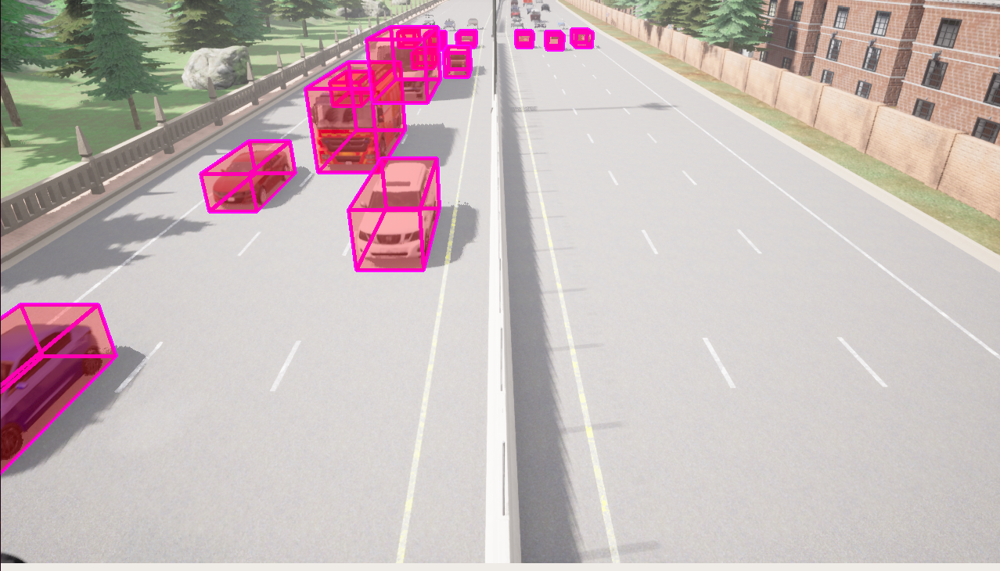

# Dataset with Carla

The Carla simulation tool is a nice way to generate groundtruth to automatically get bounding box positions and dimensions.

Once you have Carla installed, you can launch it with:

```
./CarlaUE4.sh -RenderOffScreen
```

Then you the notebook script to spawn vehicles.

You can spawn vehicles multiple times to constantly have cars driving by.

<p>
<em>Carla simulation</em></br>

</p>

This will save your images and the associated labels (X-Y positions and width/height/length of each vehicles). This is how you make your dataset.

I recommend to have the same camera pose and focal length to have the most realistic simulation.

Due to a bug with Carla 0.9.14, some vehicles like motorbikes dont have correct dimensions. This is why my neural network weights will not work with two-wheelers...

## Visualization

You can visualize your annotation by using `visualize_carla_annotation.py`

<p>
<em>Visualize bounding boxes</em></br>

</p>